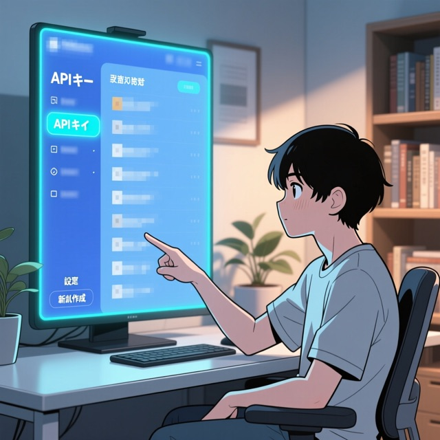
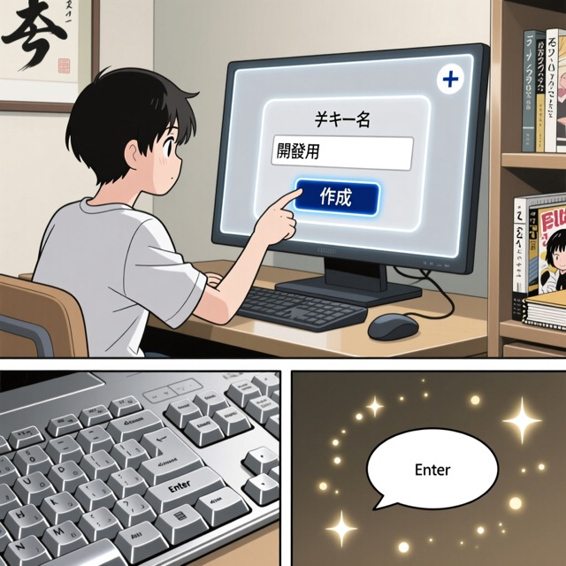
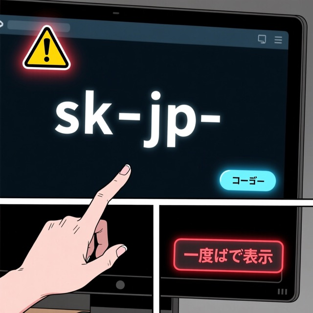
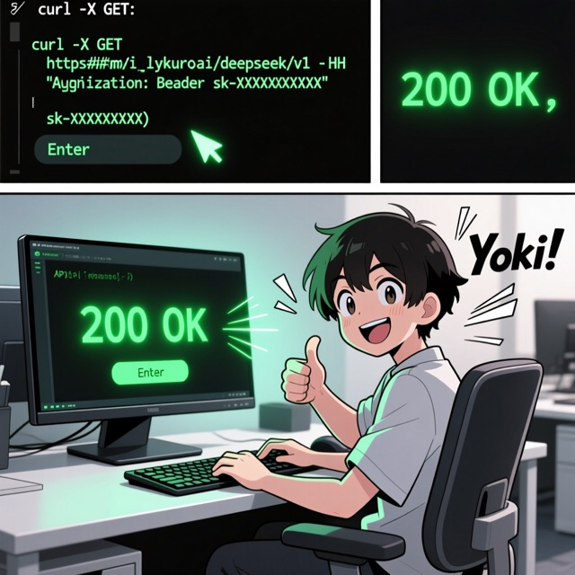

import Tabs from '@theme/Tabs';
import TabItem from '@theme/TabItem';

# 漫画風マニュアル生成

文字だけの操作マニュアルを読み込ませ、**漫画風の操作マニュアル（コマ割り画像＋吹き出し）** を
自動生成する実用サンプルです。3 種類の API を 1 つのパイプラインに組み合わせます。

| ステップ | API | モデル例 | base_url |
|---|---|---|---|
| 1. コマ割り設計 | テキスト生成 | `qwen-plus` | `/alibaba/compatible-mode/v1` |
| 2. コマ画像生成 | 画像生成（text2image） | `qwen-image` | `/alibaba/api/v1` |
| 3. 画像点検・alt付与 | ビジョン | `qwen-vl-max` | `/alibaba/compatible-mode/v1` |

```
manual.txt ──(1 テキスト生成)──> コマ割りJSON ──(2 画像生成)──> PNG ──(3 ビジョン)──> manga.html
```

:::tip すべて Lykuro 透過プロキシ経由
テキスト生成・ビジョンは **OpenAI 互換**（`/alibaba/compatible-mode/v1`）、画像生成は
**DashScope ネイティブ**（`/alibaba/api/v1`）を、`base_url` の差し替えだけで利用します。
上流キーは Lykuro 側が注入するため、クライアントは `LYKURO_API_KEY`（`sk-jp-...`）だけ持てば動きます。
:::

## 1. コマ割りを設計する（テキスト生成）

マニュアル本文を渡し、各コマの「画像プロンプト・キャプション・吹き出し」を JSON で受け取ります。
`response_format: json_object` で JSON を強制します（[構造化出力](./structured-output) 参照）。

<Tabs groupId="lang">
<TabItem value="python" label="Python">

```python
import json, os
from openai import OpenAI

client = OpenAI(
    api_key=os.environ["LYKURO_API_KEY"],
    base_url="https://api.lykuro.ai/alibaba/compatible-mode/v1",
)

SYSTEM = """操作マニュアルを漫画のコマ列に分解する編集者です。
各コマに step_title / image_prompt(英語) / caption(日本語) / speech(日本語) を付け、
{"panels":[...]} の JSON だけを返してください。"""

resp = client.chat.completions.create(
    model="qwen-plus",
    response_format={"type": "json_object"},
    messages=[
        {"role": "system", "content": SYSTEM},
        {"role": "user", "content": "次のマニュアルを最大6コマに:\n" + open("manga_manual.txt", encoding="utf-8").read()},
    ],
)
panels = json.loads(resp.choices[0].message.content)["panels"]
```

</TabItem>
<TabItem value="curl" label="cURL">

```bash
curl https://api.lykuro.ai/alibaba/compatible-mode/v1/chat/completions \
  -H "Authorization: Bearer $LYKURO_API_KEY" \
  -H "Content-Type: application/json" \
  -d '{
    "model": "qwen-plus",
    "response_format": {"type": "json_object"},
    "messages": [
      {"role": "system", "content": "操作手順を漫画コマに分解し {\"panels\":[{\"step_title\":...,\"image_prompt\":...,\"caption\":...,\"speech\":...}]} のJSONだけ返す"},
      {"role": "user", "content": "手順1: アプリを開く。手順2: ログインする。"}
    ]
  }'
```

</TabItem>
</Tabs>

## 2. コマ画像を生成する（画像生成 / text2image）

各コマの `image_prompt` から漫画風 PNG を生成します。DashScope の text2image は
**非同期方式**（タスク作成 → ポーリング → 画像URL取得）です。Lykuro は body を改変せず
透過するため、上流の契約どおりに呼べます。

<Tabs groupId="lang">
<TabItem value="python" label="Python">

```python
import time, requests

H = {"Authorization": f"Bearer {os.environ['LYKURO_API_KEY']}", "Content-Type": "application/json"}
BASE = "https://api.lykuro.ai/alibaba/api/v1"

# タスク作成（X-DashScope-Async で非同期を要求）
task = requests.post(
    f"{BASE}/services/aigc/text2image/image-synthesis",
    headers={**H, "X-DashScope-Async": "enable"},
    json={"model": "qwen-image",
          "input": {"prompt": "manga panel, a user logging into a web dashboard, clean lineart"},
          "parameters": {"size": "1024*1024", "n": 1}},
).json()
task_id = task["output"]["task_id"]

# 完了までポーリング
while True:
    time.sleep(3)
    out = requests.get(f"{BASE}/tasks/{task_id}", headers=H).json()["output"]
    if out["task_status"] == "SUCCEEDED":
        url = out["results"][0]["url"]
        open("panel_01.png", "wb").write(requests.get(url).content)
        break
    if out["task_status"] == "FAILED":
        raise RuntimeError(out.get("message"))
```

</TabItem>
<TabItem value="curl" label="cURL">

```bash
# 1) タスク作成
TASK=$(curl -s https://api.lykuro.ai/alibaba/api/v1/services/aigc/text2image/image-synthesis \
  -H "Authorization: Bearer $LYKURO_API_KEY" \
  -H "X-DashScope-Async: enable" -H "Content-Type: application/json" \
  -d '{"model":"qwen-image","input":{"prompt":"manga panel, login screen, clean lineart"},"parameters":{"size":"1024*1024","n":1}}' \
  | jq -r .output.task_id)

# 2) ポーリングして画像URLを取得
curl -s "https://api.lykuro.ai/alibaba/api/v1/tasks/$TASK" \
  -H "Authorization: Bearer $LYKURO_API_KEY" | jq -r '.output.results[0].url'
```

</TabItem>
</Tabs>

:::info 画像モデルと料金
`qwen-image`（$0.035/枚）、`qwen-image-plus`（$0.03/枚）、`wan2.2-t2i-flash`（$0.025/枚）など、
[モデル一覧](../reference/models) の「画像生成」から選べます。1コマ＝1枚課金です。
:::

## 3. 生成画像を点検し alt を付ける（ビジョン）

生成した PNG を `qwen-vl-max` に読み戻し、その手順を正しく描けているかを確認しつつ、
アクセシビリティ用の代替テキスト（alt）を 1 文で得ます（[画像入力](./vision) 参照）。

```python
import base64
b64 = base64.b64encode(open("panel_01.png", "rb").read()).decode()
alt = client.chat.completions.create(
    model="qwen-vl-max",
    messages=[{"role": "user", "content": [
        {"type": "image_url", "image_url": {"url": f"data:image/png;base64,{b64}"}},
        {"type": "text", "text": "この漫画コマを1文の日本語altで説明して。"},
    ]}],
).choices[0].message.content
```

## まとめ: そのまま動くサンプル

上記をひとつにまとめ、最後に `manga.html`（コマ画像＋吹き出し＋キャプション）を
組版する完全版を [`samples/python/manga_manual.py`](https://github.com/lykuro/lykuro-docs/tree/main/samples/python/manga_manual.py)
に置いています。

```bash
git clone https://github.com/lykuro/lykuro-docs.git
cd lykuro-docs/samples/python
cp .env.example .env          # LYKURO_API_KEY を記入
pip install -r requirements.txt
python manga_manual.py        # 同梱の manga_manual.txt から manga.html を生成
# 別のマニュアルを使う場合:
python manga_manual.py --input your_manual.txt --out out --max-panels 8
```

実行すると `out/panel_01.png … out/manga.html` が生成され、ブラウザで開くと
文字マニュアルが漫画風マニュアルに変換されています。

## 実行例（入力と結果）

同梱の `manga_manual.txt`（文字だけの操作マニュアル）を実際に変換した結果です。

**入力（抜粋）**

```text
# Lykuro ダッシュボードで API キーを発行する手順
## 手順1: ログインする
ブラウザで https://app.lykuro.ai を開きます。メールアドレスとパスワードを入力し、
「ログイン」ボタンを押します。…
## 手順4: キーを安全に控える
発行直後にだけ、完全な API キー（sk-jp- で始まる文字列）が一度だけ表示されます。…
```

**出力（漫画版・全6コマ）**

| ① ログインする | ② APIキー画面を開く | ③ 新しいキーを発行 |
|:--:|:--:|:--:|
|  |  |  |
| **④ キーを安全に控える** | **⑤ 残高をチャージする** | **⑥ 動作確認する** |
|  |  |  |

入力・吹き出し・キャプションまで並べた完全な画面は
[`samples/python/example/index.html`](https://github.com/lykuro/lykuro-docs/blob/main/samples/python/example/index.html)
をブラウザで開いて確認できます（API キー不要）。

:::warning 留意点
- 画像生成は生成1枚ごとに課金されます。`--max-panels` でコマ数を調整してください。
- 画面UIを忠実に再現したい場合は、手元のスクリーンショットを `qwen-image-edit` や
  ビジョン入力と組み合わせると精度が上がります。
- 生成画像の利用条件は上流（Alibaba Model Studio）の規約に従います。
:::
